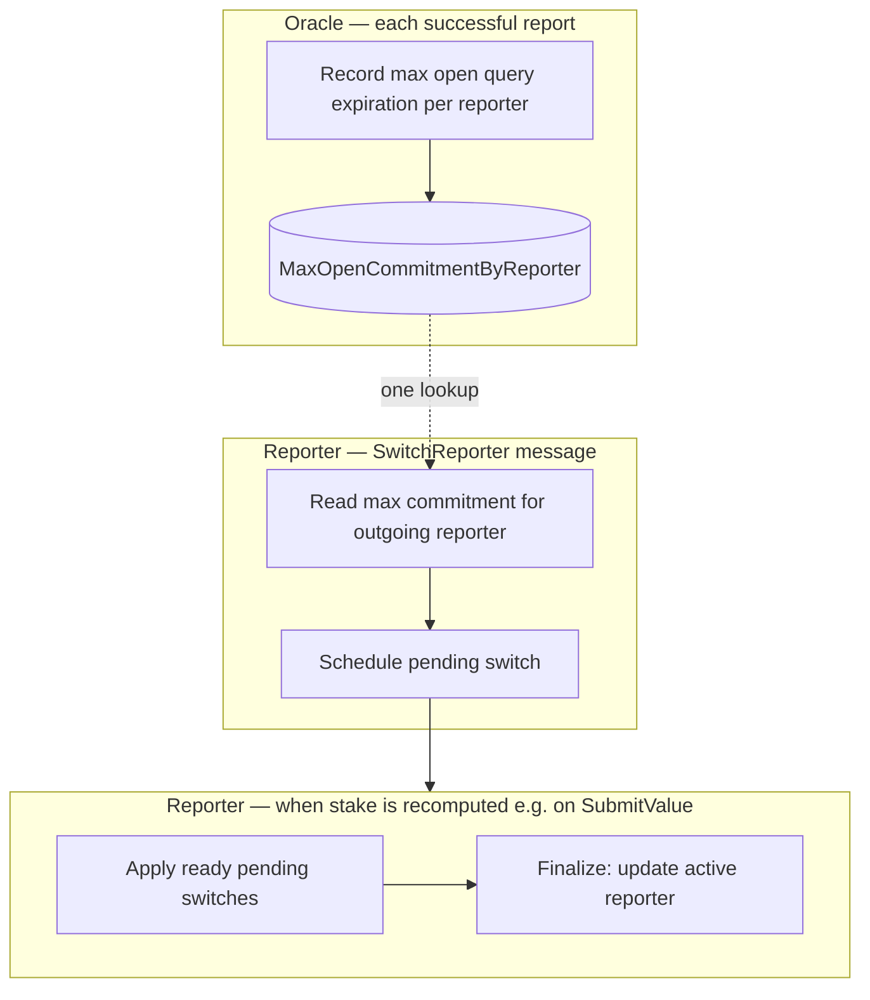
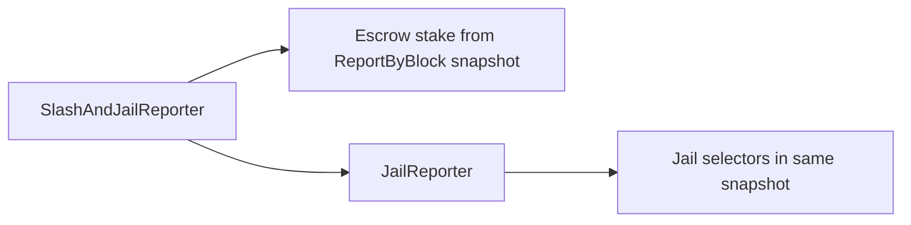

# ADR 1010: Deferred Reporter Switch and Dispute Jail Hardening

## Authors

@CJPotter10

## Changelog

- 2026-05-20: initial version
- 2026-05-29: align with implementation (v6.1.6, `dispute_locked_until`, unjail rules); rewrite for broader readability; add FAQ

---

## Summary (plain language)

Two related changes make reporter switching and dispute penalties fairer and harder to game:

1. **Deferred reporter switch** — When a selector moves their stake from reporter A to reporter B, the move is **scheduled**, not instant. Their stake stops counting for A right away, but they do not count for B until all reports from the original reporter that include the selector's stake are aggregated. Then the next time the newly selected reporter reports they will formalize the switch and include the selector's stake

2. **Dispute jail follows the report snapshot** — When a reporter loses a dispute, everyone who contributed stake to **that specific report** is penalized on their own account—not only people still listed under that reporter today. That way, switching to another reporter cannot bring disputed stake back into oracle power before the penalty expires.

Selectors can still **submit** a switch while dispute-locked; they simply **do not count** toward any reporter’s power until locks expire.

---

## Context

### Previous behavior (pre-v6.1.6)

- **`MsgSwitchReporter`** updated which reporter a selector belonged to **immediately**.
- If the outgoing reporter had reporting history, the selector often got a **~21-day wall-clock lock** (`locked_until_time`) so their stake did not count toward **any** reporter for about an unbonding period.

### Problems that motivated this ADR

| Problem | Why it mattered |
|--------|------------------|
| Instant switch + long generic lock | Awkward UX; lock was not tied to real oracle commitments |
| Dispute jail only on the reporter row | Selectors could **switch away** and count toward a new reporter while still benefiting from stake that should have been jailed (they were just slashed) |
| One field for everything | Hard to clear dispute penalties without accidentally clearing unrelated legacy locks |

### Current behavior (v6.1.6+)

1. **Reporter switch is deferred** — Stake leaves the outgoing reporter immediately; the stored “active reporter” field updates only after an oracle-derived **unlock block height**. New switches do **not** set the old ~21-day `locked_until_time` path.
2. **Dispute jail uses a report snapshot** — Penalties apply to every selector who contributed stake in the disputed report’s **`ReportByBlock`** snapshot (same set used for slashing), via **`dispute_locked_until`** on each selector’s row.
3. **Two separate lock timers on selectors** — See [Selector lock fields](#selector-lock-fields) below.

---

## Selector lock fields

Each selector has up to three independent mechanisms. Think of them as different “reasons” stake might be excluded:

| Mechanism | Field / store | What it means | Typical cause |
|-----------|---------------|---------------|---------------|
| **Legacy / non-dispute lock** | `locked_until_time` (wall clock) | Stake excluded everywhere until this time | Pre-upgrade switches; future non-dispute policy |
| **Dispute lock** | `dispute_locked_until` (wall clock) | Stake excluded everywhere until this time | Lost (or pending) dispute on a report they participated in |
| **Switch in progress** | Pending switch rows + `switch_out_locked_until_block` | Stake not on outgoing reporter; not on incoming until finalize | `MsgSwitchReporter` scheduled but not finalized |

**Reporter row jail** (`OracleReporter.jailed` / `jailed_until`) still applies to addresses that **are** reporters. Selector rows no longer duplicate `jailed` / `jailed_until`; dispute penalties on selectors use **`dispute_locked_until` only**.

**Stake exclusion rule** — A selector’s bonded stake is skipped when **either** wall-clock lock is active:

```go
locked_until_time > now  OR  dispute_locked_until > now
```

(Implemented as `SelectorStakeLocked` in `x/reporter/types/selection_lock.go`.)

**Important separation**

- Dispute code **never** writes `locked_until_time`.
- Failed disputes and unjail **only** clear `dispute_locked_until` (unless a separate path clears legacy `locked_until_time`).
- If someone has both a legacy lock and a dispute lock, **winning** the dispute removes the dispute part; the legacy lock can remain until it expires.

---

## Overview



---

## Part 1 — Deferred reporter switch

### What users experience

1. Selector sends **`MsgSwitchReporter`** from reporter **A** to **B**.
2. **Immediately:** Their stake **stops counting** toward A. It still **does not** count toward B.
3. **Waiting period:** Chain waits until block height passes an **unlock height** derived from A’s open oracle commitments (see below). Short for simple price feeds; longer when bridge-style queries with far-future expirations were submitted.
4. **Finalization:** The next time stake is recomputed for A or B (typically when either reporter **submits an oracle value**), ready switches are applied. The selector’s active reporter becomes **B**, and stake counts toward B.

While a **pending row** exists for `(outgoing A, selector)`:

- Switching to the **same** target again → **no-op** (allowed).
- Switching to a **different** target (e.g. B → C) → **allowed**; replaces the pending row (same `unlock_block` as the original schedule).

The `switch_out_locked_until_block` gate applies only when there is **no** outgoing pending row but that field is still `>=` current height (should be rare; normally cleared on finalize). In that state, any new switch away from A is rejected until height passes the stored unlock.

### Unlock timing (intuition)

| Outgoing reporter’s situation | Unlock height at schedule time | When finalize can run |
|------------------------------|--------------------------------|------------------------|
| No open commitments recorded | `0` | Next stake recompute involving A or B |
| Open work expires at block **H** | **H** (max seen so far) | After chain height **> H** (strictly greater) |
| **H** already in the past | treated as ready | Next stake recompute |

The oracle keeps a **running maximum** expiration block per reporter (updated on each `MsgSubmitValue`). That value is **fixed** when the switch is scheduled. It only ever increases, so a switch is never shortened by later reports—but an old high expiration can keep a switch pending longer than today’s open queries strictly require.

**Query types (informal)**

- **Spot-style** queries → usually short or zero unlock; handoff can complete on the next report.
- **Bridge-style** queries with long expirations → unlock tracks the longest commitment window.

### Self-reporter demoting to selector

Extra rules when the selector **is** the reporter row being removed:

- If other selectors still delegate to them, they must wait **21 days since their last oracle report** before switching away (unchanged).
- They **cannot** demote while they still have **open query commitments** (`max open commitment >= current height`).
- If the reporter row is **jailed**, dispute lock is **copied** to their selector row (`dispute_locked_until`) before the reporter row is removed, so penalties survive demotion.

### Stake vs identity (phases)

| Phase | Who the chain says they report with | Counts toward A | Counts toward B |
|-------|-------------------------------------|-----------------|-----------------|
| Right after switch tx | A (unchanged) | No | No |
| After finalize | B | N/A | Yes |

### Technical state (implementers)

| Collection | Key | Value |
|------------|-----|--------|
| `OutgoingPendingSwitches` | `(outgoing_reporter, selector)` | `PendingSwitchEntry { to_reporter, unlock_block }` |
| `IncomingPendingSwitchIdx` | `(incoming_reporter, selector)` | outgoing reporter address |
| `ReporterPendingSwitchHeads` | `reporter` | outgoing/incoming counts + min `unlock_block` (fast path before scanning) |

| `Selection` field | Role |
|-------------------|------|
| `reporter` | Active reporter for indexing; unchanged until finalize |
| `switch_out_locked_until_block` | Copy of scheduled `unlock_block`; blocks a **new** switch only when there is **no** outgoing pending row and this field is `>=` current height |
| `locked_until_time` | Legacy non-dispute exclusion; **not** set on new switches |

Param **`max_pending_switches_per_reporter`** (default **10**) caps pending rows per outgoing and per incoming reporter.

**Oracle store:** `MaxOpenCommitmentByReporter` — reporter → max `query.Expiration` block height seen on submit (`bumpMaxOpenCommitmentForReporter` in `submit_value.go`).

**`MsgSwitchReporter` flow (ordered)**

1. Validations (min stake, max selectors, reporter exists, not already on target).
2. Idempotent return if pending switch to same target already exists.
3. Self-demote path: 21-day / open-commitment / jail-copy / `Reporters.Remove` as applicable.
4. If **no** outgoing pending row: reject when `switch_out_locked_until_block >= current height`. If a pending row exists, that check is skipped (replace target or no-op instead).
5. `FlagStakeRecalc(outgoing)` → `scheduleReporterSwitch` → `FlagStakeRecalc(incoming)`.
6. On switch, `lazyClearSelectorLocksIfExpired` may clear an **expired** dispute lock and flag recalc.

**Finalization:** `ReporterStake` calls `applyReadyPendingSwitchesForReporter` first. Condition: `unlock_block < height` (strict). No BeginBlocker dedicated to switches.

```mermaid
sequenceDiagram
  participant S as Selector
  participant R as Reporter module
  participant O as Oracle

  S->>R: SwitchReporter A → B
  R->>O: Max open commitment for A
  R->>R: Schedule pending switch
  Note over R: Stake off A; reporter field still A

  Note over O: SubmitValue (A or B)
  O->>R: ReporterStake
  R->>R: Finalize if height > unlock_block
  Note over R: reporter = B; stake on B
```

---

## Part 2 — Dispute jail hardening

### What users experience

When a dispute is resolved against a reporter (after fees are paid and slash/jail runs):

1. **Reporter account** (if it still exists) is marked jailed for the dispute category’s duration.
2. **Every selector in the report snapshot** at the disputed block gets **`dispute_locked_until`** extended to the jail end time (wall clock). This uses the same delegator list as slashing—not “who is indexed under that reporter right now.”
3. While `dispute_locked_until` is in the future, that selector’s stake is **excluded** from **every** reporter’s oracle power and from dispute vote power.
4. **`MsgSwitchReporter` is still allowed**; it does not bypass the lock.

**Jail durations (examples)**

| Dispute level | Reporter slash (illustrative) | Jail duration |
|---------------|-------------------------------|---------------|
| Warning | 1% | Effectively immediate unjail eligibility (duration 0) |
| Minor | 5% | **600 seconds** (~10 minutes) |
| Major | 100% | Very long / “until unjail or win” |

### Unjail and failed disputes

| Event | Reporter row | Selector `dispute_locked_until` | Selector `locked_until_time` |
|-------|--------------|-----------------------------------|------------------------------|
| **`MsgUnjailReporter`** (self, after sentence) | Cleared if jailed | Cleared if active | **Not** cleared by default |
| **`MsgUnjailReporter`** (third party) | Same | Same | Same |
| Third-party timing | — | Allowed only **7 days after** self-unjail would have been allowed | — |
| **Reporter wins dispute** (`UpdateJailedUntilOnFailedDispute`) | Jail shortened on reporter row | Cleared for snapshot delegators | **Preserved** |

Self-reporter demotion while jailed: **`copyReporterJailToSelection`** sets `dispute_locked_until` from the reporter’s `JailedUntil` before removing the reporter row.

### Technical flow (implementers)

`SlashAndJailReporter` → `EscrowReporterStake` (snapshot) + `JailReporter`:

1. If reporter row exists: set `Jailed`, `JailedUntil` (max with existing).
2. `jailSelectorsFromReportSnapshot` → `lockSelectorRowDispute` per delegator in `ReportByBlock` at `report.BlockNumber`.

Failed dispute: `clearSelectorLocksFromReportSnapshot` → `clearDisputeLock` only.



**Where stake lock is enforced**

- `GetReporterStake` / `ReporterStake`
- Dispute voting (`vote.go`)
- Lazy expiry path when reading selectors (`lazyClearSelectorLocksIfExpired`)

---

## Invariants

1. At most one outgoing pending row per `(outgoing_reporter, selector)`; switching to the same pending target is idempotent.
2. Outgoing reporter stake never includes selectors with an outgoing pending row for that reporter.
3. Incoming reporter stake never includes a selector until finalize sets `Selection.reporter`.
4. Dispute slash, jail, and failed-dispute unlock use the same **`ReportByBlock`** delegator set at `report.BlockNumber`.
5. `unlock_block` on a pending switch is the oracle max-commitment value **at schedule time** (unchanged if the pending row is replaced to a different target—replacement keeps the prior unlock block).
6. Dispute paths never read or write `locked_until_time`; `dispute_locked_until` is never copied into `locked_until_time`.

---

## Upgrade

**v6.1.6** (`app/upgrades/v6.1.6/`): module migrations; new collections and proto fields default to empty/zero. No custom state walk beyond `RunMigrations`.

---

## FAQ

### Reporter switching

**Can I switch reporters while I am dispute-locked?**  
Yes. The switch transaction is allowed. Your stake still does **not** count toward **any** reporter (including the new one) until `dispute_locked_until` expires—and until the pending switch finalizes, as usual.

**When does my stake count toward the new reporter?**  
Only after two things: (1) the pending switch **finalizes** (active reporter field updates to the new address), and (2) you are not excluded by `dispute_locked_until` or `locked_until_time`. Finalization usually happens on the next oracle report that triggers stake recompute for the old or new reporter (often the next `SubmitValue`).

**What triggers finalization of my switch?**  
The chain checks pending switches at the start of **reporter stake recompute**—typically when a reporter submits an oracle value. There is no separate “finalize switch” message. If the unlock height is already in the past, the next such event can complete the handoff.

**Why is my switch still pending?**  
The unlock height is based on the **outgoing** reporter’s longest recorded open query expiration at the time you switched. Bridge-style queries with far-future expirations can delay finalization. The stored max only ever increases, so an old high expiration can keep you waiting longer than today’s open queries might suggest.

**Do new switches still get a ~21-day lock on my stake?**  
No. New switches use the **block-height pending handoff**, not a fresh ~21-day `locked_until_time`. You may still have an **old** `locked_until_time` from before the upgrade or from other policy—that is separate.

**I already submitted a switch to reporter B. Can I submit the same switch again?**  
If a pending switch to **B** already exists, sending the same switch again succeeds as a **no-op**. To change target to reporter C, you need a different pending row (subject to caps and lock rules).

**Can I start another switch while one is in progress?**  
**It depends.** If a pending row already exists (A → B in flight):

- Same target B again → yes, no-op.
- Different target C → yes; pending becomes A → C (original `unlock_block` is kept).

You cannot have two separate pending handoffs from the same outgoing reporter for the same selector—only one outgoing pending row, which you may **replace**.

If there is **no** pending row but `switch_out_locked_until_block` is still at or above the current height, a new switch is **rejected** until that height passes (normally this field is cleared when a pending switch finalizes).

**I am a reporter demoting myself to selector. Anything extra?**  
Yes, if others still select you: you must wait **21 days since your last report**. You also cannot demote while you still have **open query commitments**. If your reporter account is jailed, that jail is copied to your selector row before the reporter row is removed.

### Disputes and locks

**I switched away before a dispute on my old reporter. Can I still be penalized?**  
Yes, if your stake was in the **report snapshot** at the disputed block. Dispute jail uses that snapshot, not “who you report with today.” You get `dispute_locked_until` on your own selector row and your stake is excluded everywhere until it expires.

**What is the difference between `locked_until_time` and `dispute_locked_until`?**  
`locked_until_time` is for **non-dispute** exclusion (e.g. legacy ~21-day locks from older switch behavior). `dispute_locked_until` is **only** for dispute penalties. Dispute code never touches `locked_until_time`. Either one active is enough to exclude your stake.

**The reporter won the dispute. What happens to me as a selector?**  
If you were locked only via **`dispute_locked_until`** from that dispute, that lock is cleared for delegators in the report snapshot. If you also have **`locked_until_time`** (e.g. from an old switch), that stays until its time passes.

**How long does a minor dispute lock last?**  
About **600 seconds** (~10 minutes) of chain time for the jail duration used when setting `dispute_locked_until` (same window as reporter jail for minor disputes). Major disputes use a much longer sentence; warnings are effectively immediate for unjail eligibility.

**Can I vote in disputes while dispute-locked?**  
Your stake is excluded from **reporter oracle power** and from **dispute vote power** while `SelectorStakeLocked` is true (either wall-clock lock field active).

### Unjail

**How do I clear a dispute lock on my selector account?**  
Wait until `dispute_locked_until` is in the past, then call **`MsgUnjailReporter`** on your own address (if you also have a reporter row, that is cleared too when applicable). The chain may also lazy-clear an expired dispute lock when you interact with reporter messages.

**Can someone else unjail me?**  
Yes. You have 7 days to address any problems and unjail yourself. Anyone can unjail you after that 7 day period. This is to prevent people waiting 21 days in a jailed state to avoid disputes.

**Does unjail remove my old ~21-day `locked_until_time`?**  
No. Unjail clears **dispute** lock (`dispute_locked_until`) and reporter-row jail. Legacy `locked_until_time` is unchanged unless a separate path clears it.

---

## Implementation map

| Area | Path |
|------|------|
| Pending switch | `x/reporter/keeper/pending_switch.go` |
| Switch / create reporter msgs | `x/reporter/keeper/msg_server.go` |
| Stake + finalize entry | `x/reporter/keeper/reporter.go` |
| Jail / unjail | `x/reporter/keeper/jail.go` |
| Stake lock helper | `x/reporter/types/selection_lock.go` |
| Oracle max commitment | `x/oracle/keeper/max_open_commitment.go`, `submit_value.go` |
| Dispute slash/jail | `x/dispute/keeper/dispute.go`, `execute.go` |
| Proto | `proto/layer/reporter/selection.proto`, `params.proto` |
| Chain upgrade | `app/upgrades/v6.1.6/upgrade.go` |

---

## Operational notes

- **Monotonic max commitment** can defer switches longer than the live set of open queries strictly requires.
- **Self-reporter with other selectors** still requires 21 days since last report before delegating reporting to another reporter.
- **Self-reporter demotion** is blocked while `max open commitment >= current height`.
- Legacy **`locked_until_time`** from pre-upgrade switches continues to exclude stake until it expires; winning a dispute does not remove it.
- **Switch while dispute-locked** is allowed; stake remains excluded until `dispute_locked_until` passes (and any legacy lock).
- Integration coverage: `tests/integration/reporter_switch_test.go`, `e2e/dispute_test.go` (switch + dispute scenarios).
